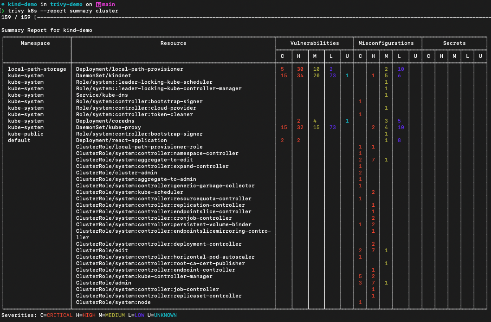

<div align="center">


[![GitHub Release][release-img]][release]
[![Test][test-img]][test]
[![Go Report Card][go-report-img]][go-report]
[![License: Apache-2.0][license-img]][license]
[![GitHub Downloads][github-downloads-img]][release]
![Docker Pulls][docker-pulls]

[📖 Documentation][docs]
</div>

Vul ([pronunciation][pronunciation]) is a comprehensive and versatile security scanner.
Vul has *scanners* that look for security issues, and *targets* where it can find those issues.

Targets (what Vul can scan):

- Container Image
- Filesystem
- Git Repository (remote)
- Virtual Machine Image
- Kubernetes
- AWS

Scanners (what Vul can find there):

- OS packages and software dependencies in use (SBOM)
- Known vulnerabilities (CVEs)
- IaC issues and misconfigurations
- Sensitive information and secrets
- Software licenses

Vul supports most popular programming languages, operating systems, and platforms. For a complete list, see the [Scanning Coverage] page.

To learn more, go to the [Vul homepage][homepage] for feature highlights, or to the [Documentation site][docs] for detailed information.

## Quick Start

### Get Vul

Vul is available in most common distribution channels. The full list of installation options is available in the [Installation] page. Here are a few popular examples:

- `brew install vul`
- `docker run aquasec/vul`
- Download binary from <https://github.com/khulnasoft-lab/vul/releases/latest/>
- See [Installation] for more

Vul is integrated with many popular platforms and applications. The complete list of integrations is available in the [Ecosystem] page. Here are a few popular examples:

- [GitHub Actions](https://github.com/khulnasoft-lab/vul-action)
- [Kubernetes operator](https://github.com/khulnasoft-lab/vul-operator)
- [VS Code plugin](https://github.com/khulnasoft-lab/vul-vscode-extension)
- See [Ecosystem] for more

### Canary builds
There are canary builds ([Docker Hub](https://hub.docker.com/r/aquasec/vul/tags?page=1&name=canary), [GitHub](https://github.com/khulnasoft-lab/vul/pkgs/container/vul/75776514?tag=canary), [ECR](https://gallery.ecr.aws/khulnasoft-lab/vul#canary) images and [binaries](https://github.com/khulnasoft-lab/vul/actions/workflows/canary.yaml)) as generated every push to main branch.

Please be aware: canary builds might have critical bugs, it's not recommended for use in production.

### General usage

```bash
vul <target> [--scanners <scanner1,scanner2>] <subject>
```

Examples:

```bash
vul image python:3.4-alpine
```

<details>
<summary>Result</summary>

https://user-images.githubusercontent.com/1161307/171013513-95f18734-233d-45d3-aaf5-d6aec687db0e.mov

</details>

```bash
vul fs --scanners vuln,secret,config myproject/
```

<details>
<summary>Result</summary>

https://user-images.githubusercontent.com/1161307/171013917-b1f37810-f434-465c-b01a-22de036bd9b3.mov

</details>

```bash
vul k8s --report summary cluster
```

<details>
<summary>Result</summary>



</details>

## FAQ

### How to pronounce the name "Vul"?

`tri` is pronounced like **tri**gger, `vy` is pronounced like en**vy**.

## Want more? Check out Aqua

If you liked Vul, you will love Aqua which builds on top of Vul to provide even more enhanced capabilities for a complete security management offering.  
You can find a high level comparison table specific to Vul users [here](https://github.com/aquasecurity/resources/blob/main/vul-aqua.md).  
In addition check out the <https://aquasec.com> website for more information about our products and services.
If you'd like to contact Aqua or request a demo, please use this form: <https://www.aquasec.com/demo>

## Community

Vul is an [Aqua Security][aquasec] open source project.  
Learn about our open source work and portfolio [here][oss].  
Contact us about any matter by opening a GitHub Discussion [here][discussions]
Join our [Slack community][slack] to stay up to date with community efforts.

Please ensure to abide by our [Code of Conduct][code-of-conduct] during all interactions.

[test]: https://github.com/khulnasoft-lab/vul/actions/workflows/test.yaml
[test-img]: https://github.com/khulnasoft-lab/vul/actions/workflows/test.yaml/badge.svg
[go-report]: https://goreportcard.com/report/github.com/khulnasoft-lab/vul
[go-report-img]: https://goreportcard.com/badge/github.com/khulnasoft-lab/vul
[release]: https://github.com/khulnasoft-lab/vul/releases
[release-img]: https://img.shields.io/github/release/khulnasoft-lab/vul.svg?logo=github
[github-downloads-img]: https://img.shields.io/github/downloads/khulnasoft-lab/vul/total?logo=github
[docker-pulls]: https://img.shields.io/docker/pulls/aquasec/vul?logo=docker&label=docker%20pulls%20%2F%20vul
[license]: https://github.com/khulnasoft-lab/vul/blob/main/LICENSE
[license-img]: https://img.shields.io/badge/License-Apache%202.0-blue.svg
[homepage]: https://vul.dev
[docs]: https://aquasecurity.github.io/vul
[pronunciation]: #how-to-pronounce-the-name-vul
[slack]: https://slack.aquasec.com
[code-of-conduct]: https://github.com/aquasecurity/community/blob/main/CODE_OF_CONDUCT.md

[Installation]:https://aquasecurity.github.io/vul/latest/getting-started/installation/
[Ecosystem]: https://aquasecurity.github.io/vul/latest/ecosystem/
[Scanning Coverage]: https://aquasecurity.github.io/vul/latest/getting-started/coverage/

[alpine]: https://ariadne.space/2021/06/08/the-vulnerability-remediation-lifecycle-of-alpine-containers/
[rego]: https://www.openpolicyagent.org/docs/latest/#rego
[sigstore]: https://www.sigstore.dev/

[aquasec]: https://aquasec.com
[oss]: https://www.aquasec.com/products/open-source-projects/
[discussions]: https://github.com/khulnasoft-lab/vul/discussions
